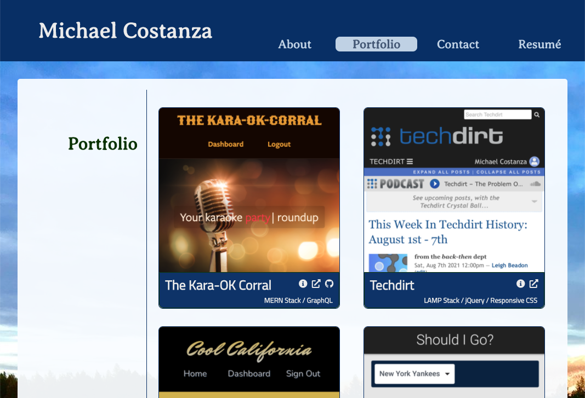

# Michael Costanza's Portfolio

A bit of background, some samples of my work, and contact information, presented as a single-page application, built using React.

[See the portfolio >>](https://costanza13.github.io/react-portfolio/)

## Features/Functionality

- The portfolio loads in the "About" view, and presents 4 navigation links in the header to switch between the About, Portfolio, Contact and Resumé views. Clicking these links loads the view, and appends the corresponding anchor to the URL (e.g., "#portfolio") -- the page is not fetched from the server. The name in the header is a link to the root URI and can be used to reload the app.

- The footer displays icons that link to my LinkedIn, GitHub and Facebook profiles.

- The Portfolio view presents an overview of a selection of projects I've worked on, each project component including a screenshot, links to the deployed app and associated GitHub repository (where apporpriate), and a list of some of the technologies used on the project. Mousing over the screenshot (or tapping on it on mobile) will reveal a control to view more information on the project -- called the ProjectSpotlight.

- Contact link opens the contact form view (currently not hooked up). Visitors can use the form or the links below it to reach me. The contact form includes some input validation and displays an error message if any of the form fields are not completed correctly.

- The Resumé view show a list of my skills and proficiencies, along with an embedded copy of my resumé and a link to view or download a PDF copy. *Note: I attempted to embed my PDF resumé using `react-pdf`, but I was unable to get it to work in the built version of the page. For now, I've included images instead.

